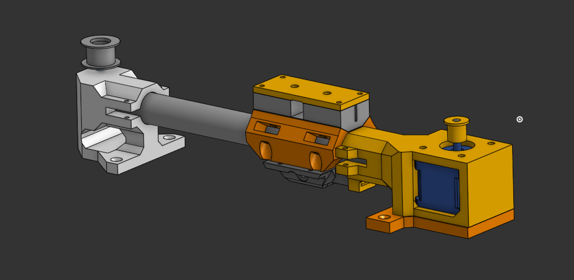
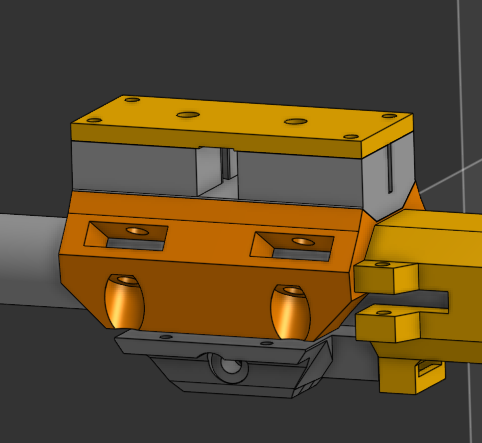
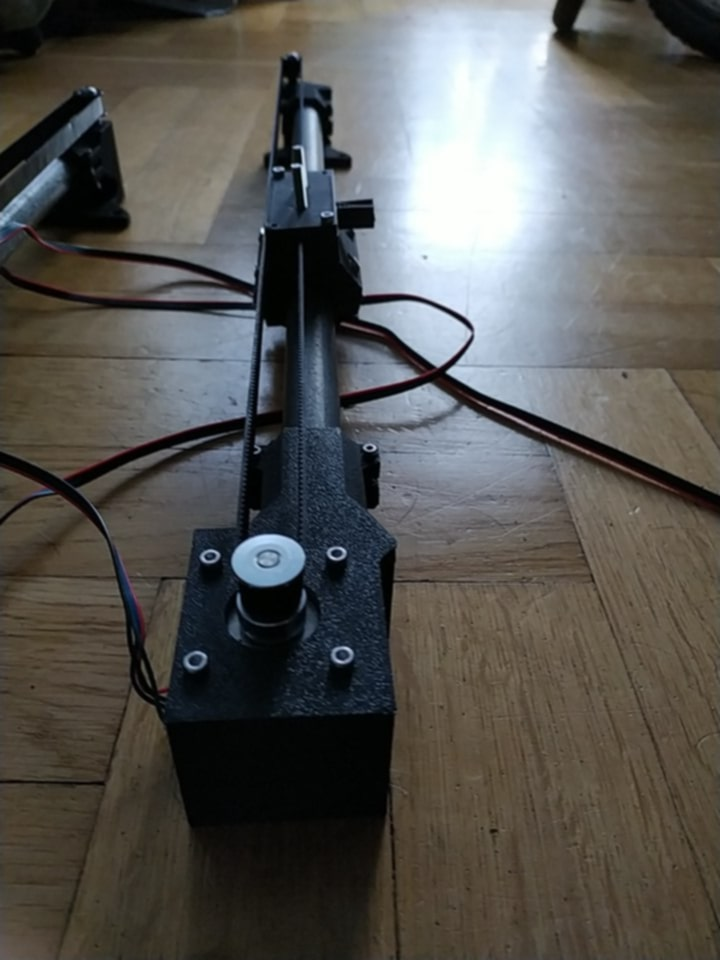
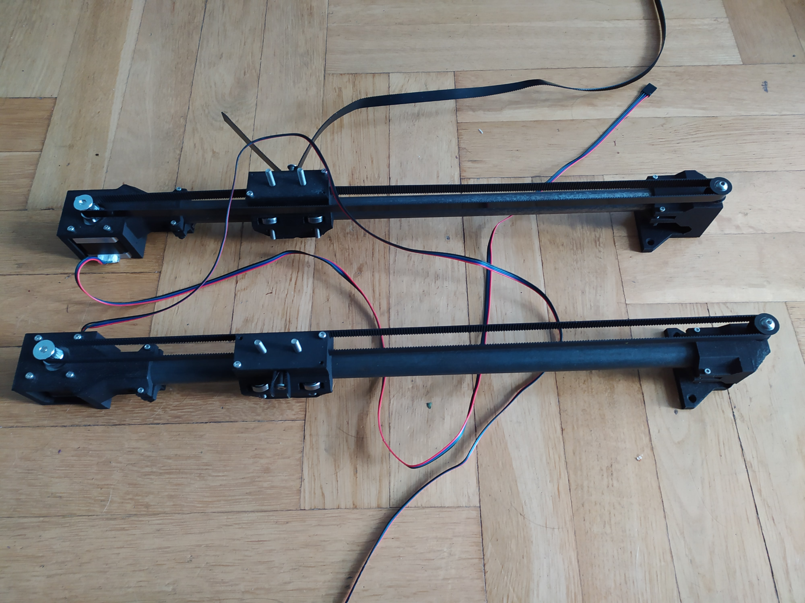
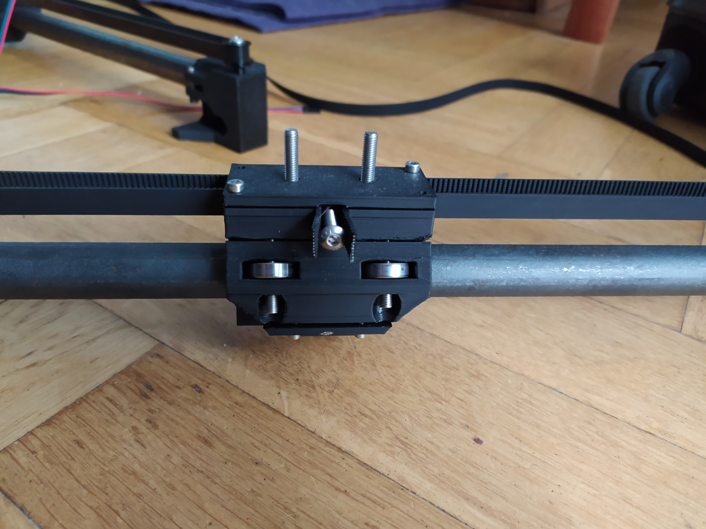

# CNC-Machine

# CNC Machine - Custom Build Project

## Purpose

Presentation of the final version of the project for my portfolio. This project involves the design and construction of a custom 3-axis CNC (Computer Numerical Control) machine. The primary goal is to build a functional machine capable of precision cutting and engraving in materials like wood and plywood, with potential for light aluminum milling in the future. This project emphasizes **cost-effectiveness and innovative use of readily available components** to achieve high performance.

## Current Progress & Status

As of **June 2025**, the project is in the **design and assembly phase**, with significant progress on mechanical and initial electrical components.

* **X-axis linear guide systems (both rails and custom-built carriages) are fully assembled.**
* **Initial control of stepper motors has been successfully implemented and tested.**
* Detailed CAD models for various individual components have been created.
* Focus is currently on refining the carriage design to improve precision and ensure mechanical rigidity for the moving gantry architecture.

## Inspiration

This project draws significant inspiration from the highly successful open-source CNC designs by V1 Engineering, specifically the [MPCNC](https://docs.v1e.com/mpcnc/intro/) and [LowRider](https://docs.v1e.com/lowrider/) machines. These projects demonstrate effective and economical approaches to building capable CNC systems, which greatly influenced the design philosophy for this custom build.

## Key Aspects & Technologies

Since this is a hardware project, the focus is on the engineering process, design choices, and mechanical implementation rather than software code.

* **Custom Linear Motion Systems:**
    * Instead of off-the-shelf linear rails, the design utilizes **standard steel rods** as precision linear shafts.
    * **Custom-designed carriages** leverage readily available **5x16x5mm bearings** (approx. 1 PLN/piece) to create an ultra-precise linear motion system, demonstrating a resourceful approach to component selection.
    * **Belt-driven system** using **GT2 10mm belts** for low stretch and reliable power transmission.
* **CAD Modeling (Onshape):**
    * Individual machine components are meticulously designed in Onshape. This includes:
        * Detailed models of parts such as motor mounts, gantry plates, custom carriage components, and roller systems.
        * **Although full assembly models were challenging to implement in Onshape, careful attention was paid to individual part clearances and fit during design to ensure mechanical compatibility.**
    * Emphasis on parametric design for flexibility and easy modifications.
    * **Explore the Onshape project:** [https://cad.onshape.com/documents/ce3126510393088999471095/w/0db2248d6824e60ffc8700c2/e/9ebff592ddd36325d4f23617?renderMode=0&uiState=683f31c622b1037ac0a3dcb0] (Highly recommended: This link allows direct interaction with the 3D models.)
* **3D Printing & Prototyping:**
    * Extensive use of 3D printing (on **Bambu Lab A1 Mini** using **Bambu Studio** slicer) for prototyping custom parts, brackets, and fixtures.
    * **PLA filament** is used for its ease of printing and suitability for prototyping mechanical components.
* **Component Standardization & Load Bearing:**
    * The project adheres to three standard screw sizes: **M2.5, M3, and M5**.
    * **M2.5 screws** are primarily used for clamping collars onto rods (e.g., for motor mounting).
    * **M3 screws** ensure compatibility with the **NEMA 17 stepper motors** used for motion control.
    * **M5 screws** are integrated with the bearings and smooth rollers in the belt system, chosen for their ability to withstand high loads.

## Challenges & Problem Solving

* The most significant challenge currently is the **design of the custom carriages**.
* Existing carriage iterations exhibit **noticeable backlash** and are **not sufficiently wide** to adequately support the heavy gantry and rotor (moving gantry architecture).
* **Planned Solution:** To address these issues, the approach involves **adding an extra bearing** in the axis most susceptible to bending and **extending the overall length of the carriage** to provide more stability and reduce deflection.
* This ongoing challenge highlights the iterative nature of engineering design and the continuous effort to optimize for precision and rigidity.

## Visual Documentation

As this project has no executable code yet, visual documentation is crucial to showcase the progress and quality of work. Please find screenshots from Onshape models and photographs of the assembled components below.

### Onshape Model Screenshots

**1. Overall X-axis Assembly Concept (CAD)**

*Figure 1: Conceptual overview of the X-axis linear guide system, designed in Onshape.*

**2. Custom Carriage Detail (CAD)**

*Figure 2: Close-up view of the custom 3D-printed carriage design, highlighting bearing placement.*

### Photographs of Assembled Components

**3. Motor Mount/Belt System (CAD)**

*Figure 3: CAD rendering showing the integration of the NEMA 17 motor mount and GT2 belt system.*

**4. Assembled X-axis Linear Guides**

*Figure 4: Photograph of one completed X-axis linear guides, featuring the steel rod and custom carriage.*

**5. Carriage Close-up (Physical)**

*Figure 5: Detailed photo of the physical custom carriage, showing the 5x16x5mm bearings in place.*

## Skills Demonstrated

* **Mechanical Design & Engineering (Emphasis on Cost-Effective Solutions)**
* **Computer-Aided Design (CAD) - Onshape proficiency (Component Design & Fit Verification)**
* **3D Printing & Prototyping (Bambu Lab A1 Mini, Bambu Studio, PLA)**
* **Problem-Solving & Iterative Design**
* **Project Planning & Execution**
* **Hardware Assembly & Integration**
* **Initial Electronics and Motor Control**
* **Attention to Detail & Precision**

## Future Plans

* Refinement and re-design of the X-axis carriages based on the planned improvements to eliminate backlash and improve stability.
* Completion of Y and Z axis assembly.
* Further integration of stepper motors and motor drivers, including full wiring and testing.
* Development/configuration of control electronics (e.g., GRBL, custom firmware).
* Software integration for CAM (Computer-Aided Manufacturing) and G-code generation.
* Initial test cuts and calibration.
